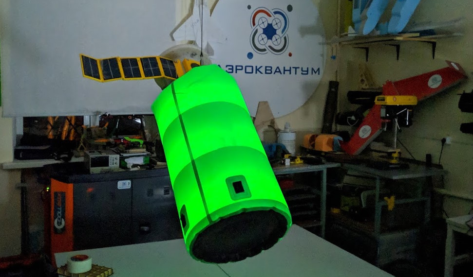

# Восток-27

## О компоненте

Прошивка для бортового контроллера станции «Восток-27»‎.

## О проекте

Раздуваемый модуль космической станции «Восток-27» — проект реализованный в рамках ICCET Kvantoriada '19.

## Архитектура

Архитектура проекта представляет собой схему Slave ⇄ Master.

Arduino выступает зависимым Slave, который не выполняет действий без команд со стороны Master.

В качестве Master выступает любое другое Bluetooth устройство, которое реализует протокол. В рамках проекта таковым выступает любое Android устройство с приложением. [Подробнее здесь](https://github.com/sqxx/vostok-27-control-panel).

## Протокол

Протокол обмена данными представляет возможность реализовать обработку 256 команд с размером передачи данных до 4 байт. Подробное описание протокола и системы команд, реализуемой контроллером, можно [посмотреть здесь](./Docs/Protocol.md).